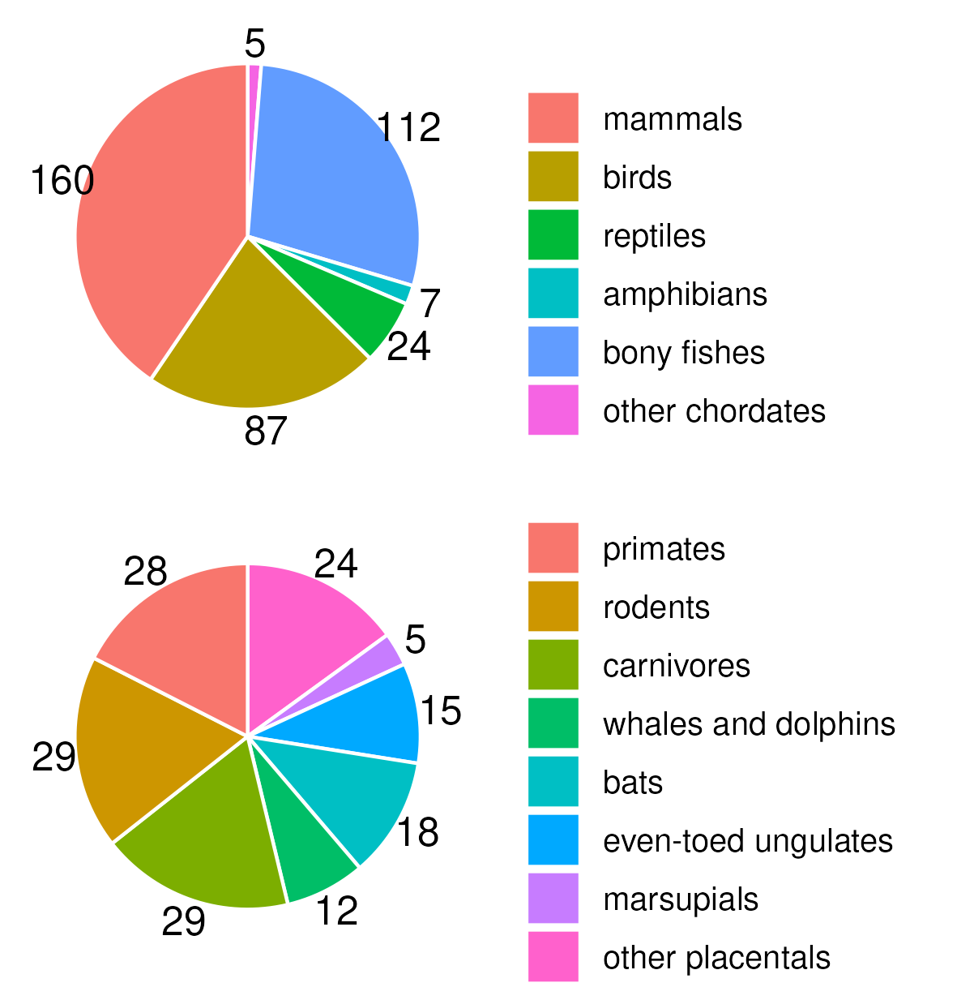
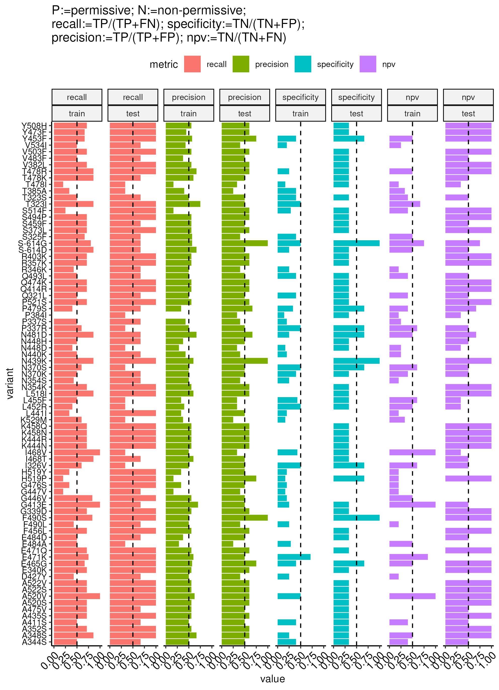

This is the repository for reproducing the computational results of "REPOST: A Framework for fast Prediction of Potential Host Ranges of Pathogenic Viruses Based on Receptor Ortholog Analysis".

All computationally generated (raw) figures are included in this git repository.

# Prerequisites for reproducing the computational results
 
  - NCBI datasets  
    - version 12.12.10 was used
	- downloaded from https://ftp.ncbi.nlm.nih.gov/pub/datasets/command-line/LATEST/linux-amd64/datasets
	- the binary executable was renamed as `./tools/datasets`
  - MUSCLE
	- downloaded from http://www.drive5.com/muscle/downloads3.8.31/muscle3.8.31_src.tar.gz
	- the binary executable was renamed as `./tools/muscle3.8.31/src/muscle`
  - R CRAN packages
	- `data.table`
	- `foreach`
	- `ggpubr`
	- `ggsci`
    - `glue`
	- `magrittr`
	- `readxl`
	- `reutils`
	- `UpSetR`
	- `XML`
  - R Bioconductor packages
    - `Biostrings`

# In Step 1: collect ACE2 orthologs and analyze their distributions (Figure 2)

## Download the ACE2 orthologs and their meta information

NOTE: we found that datasets retrieved from NCBI would be different if downloaded at different dates, possibly due to the continuous update of NCBI database.
Therefore, we included into our git repository such files downloaded and analyzed in this manuscript. 
Users who would like to reproduce the exact results are recommended to skip this step and start from the next step.

- Retrieve the orthologs (`results/Step1/NCBI_datasets_download_ortholog_ACE2_human/ncbi_dataset/data/protein.faa` and `results/Step1/NCBI_datasets_download_ortholog_ACE2_human/ncbi_dataset/data/data_table.tsv`, both included in the git repository)
``` shell
mkdir -p results/Step1/NCBI_datasets_download_ortholog_ACE2_human/
./tools/datasets download ortholog symbol ACE2 --taxon human --filename results/Step1/NCBI_datasets_download_ortholog_ACE2_human.zip
unzip -d results/Step1/NCBI_datasets_download_ortholog_ACE2_human/ results/Step1/NCBI_datasets_download_ortholog_ACE2_human.zip
```

- Retrieve the meta information (`results/Step1/NCBI_datasets_download_ortholog_ACE2_human/tax.core.info.dt.csv`, included in the git repository)

``` shell
Rscript ./Step1-retrieve-meta-information.R
```


## Align sequences with `MUSCLE`

``` shell
./tools/muscle3.8.31/src/muscle -in results/Step1/NCBI_datasets_download_ortholog_ACE2_human/ncbi_dataset/data/protein.faa -out results/Step1/NCBI_datasets_download_ortholog_ACE2_human/protein.muscle.alignment.fasta
```

## Analyze these orthologs

``` shell
Rscript ./Step1-analyze.R
```

- Figure 2A (without dashed gray line bubble): `results/Step1/NCBI_datasets_download_ortholog_ACE2_human/Fig2A.png`
  - 
- Figure 2B: `results/Step1/NCBI_datasets_download_ortholog_ACE2_human/Fig2B.png`
  - 
- `results/Step1/NCBI_datasets_download_ortholog_ACE2_human/protein.identity.info.with.species.category.dt.csv` (will be used in Step 4; also included in this git repository)

# In Step 2: assay the pilot set

No computationally generated data in this step (Figure 3B is a simple summary of raw experimental data).

- Supplementary Table S1: the pilot set
  - `results/Step2/SARS-CoV-2_first_round_info.csv` (also included in this git repository)
  - 16 were assayed by us and the rest 5 are from published data (indicated by the `evidence` column).

# In Step 3: find the non-permissive-informative residue positions

We start with the amino acid sequences of 21 orthologs assayed in Step 2: `results/Step3/SARS-CoV-2_first_round_sequences_alignment.fasta` (also included in this git repository).

``` shell
Rscript ./Step3-find-informative-positions.R 
```

- Supplementary Table S2: the 193 non-permissive-informative residue positions.
  - `results/Step3/SARS-CoV-2_first_round_non-permissive_informative.dt.csv` (also included in this git repository)
- Figure 3C: `results/Step3/first_round_nonpermissive_informative_position_overlap.png`
  - 

# In Step 4: build the model

We start with the following files:
- `results/Step1/NCBI_datasets_download_ortholog_ACE2_human/ncbi_dataset/data/protein.faa` from Step 1
- `results/Step1/NCBI_datasets_download_ortholog_ACE2_human/protein.identity.info.with.species.category.dt.csv` from Step 1
- Dataset\_S01 of [Liu et al. 2021: Functional and genetic analysis of viral receptor ACE2 orthologs reveals a broad potential host range of SARS-CoV-2.](https://dx.doi.org/10.1073/pnas.2025373118) : `external/papers/DOI/10.1073/pnas.2025373118/pnas.2025373118.sd01.xlsx` (also included in this git repository)
- Pilot ortholog sequences not automatically collected by NCBI datasets and thus need to be manually appended (all included in this git repository):
  - `./results/Step2/XP_007989304.1.fasta` 
  - `./results/Step2/AAX63775.1.fasta` 
  - `./results/Step2/ACT66275.1.fasta` 
- Ortholog sequences of Liu et al. 2021 that are not automatically collected by NCBI datasets and thus need to be manually appended (all included in this git repository):
  - `./results/Step4/XP_002930657.1.fasta` 
  - `./results/Step4/XP_010334925.1.fasta` 
  - `./results/Step4/XP_015974412.1.fasta` 
  - `./results/Step4/XP_017505746.1.fasta` 
  - `./results/Step4/XP_019781177.1.fasta`
- `results/Step2/SARS-CoV-2_first_round_info.csv` from Step 2
- `results/Step3/SARS-CoV-2_first_round_non-permissive_informative.dt.csv` from Step 3
- `results/Step4/SARS-CoV-2.second.round.test.protein.info.csv`, the experimental validation results for 11 non-permissive orthologs. We merge this table with the prediction table to generate the comparison table (Supplementary Table S4).

``` shell
Rscript ./Step4-build-model.R 
```

- Supplementary Table S3: predicion for all mammalian orthologs: `results/Step4/prioritization.within.different.species.SC2.dt.csv` (also included in this git repository)
- Figure 4A: `results/Step4/Liu2020.test.validation.tile.png`
  - 
- Supplementary Table S4: comparison between prediction and experimental results for the 11 experimentally tested non-permissive orthologs: `./results/Step4/SARS-CoV-2.second.round.test.prediction.and.exp.comparison.dt.csv`
- Supplementary Figure S1: distribution of weighted distance of each pilot non-permissive ortholog (shown in facet labels) to other pilot orthologs.: `results/Step4/SF1.png` 
  - 

# SARS-CoV-2 variant analysis

## Setting up the input

We start with the dataset described by Fig. 2A of [Zhang et al. 2022: Cross-species tropism and antigenic landscapes of circulating SARS-CoV-2 variants](https://doi.org/10.1016/j.celrep.2022.110558).
To make it readable by computer, we have transcribed this table into plain-text (with Brown trout excluded); see `./SARS-CoV-2-variants-CR22/all.label.fixed.dt.csv` (also included in this git repository), where relevant columns are described below:
- `species.name` is the name of the row species.
- `variant.name` is the name of the column variant.
- `label` is the infection performance for the column variant on the ortholog of the row species.
- `best.split.at` is the threshold at or above which the infection performance is binarized to be permissive, and below which the performance is binarized to be non-permissive. The "best" means that the difference in the number of permissives and non-permissives is minimized at this threshold.
- `label.fixed` is the binarzied label (permissive or non-permissive) at the `best.split.at` threshold.

In addition, we also identified all the protein accessions of these orthologs according to Table S1 of Zhang et al. 2022, and saved them in the file `./SARS-CoV-2-variants-CR22/SARS-CoV-2_CR22.csv`.

## Obtain the ortholog sequences


``` shell
cd ./SARS-CoV-2-variants-CR22/
Rscript ./retrieve_sequences.R
cd ..
```

- protein sequences for all 17 mammals: `./SARS-CoV-2-variants-CR22/all.17.mammals.protein.sequences.fasta` (also included in this git repository)
  - We found that `XP_004758943.1` cannot be retrieved by E-Utils, so we manually downloaded it (`./SARS-CoV-2-variants-CR22/XP_004758943.1.fasta`; also included in this git repository) and appended it to this fasta file.

## Run REPOST per variant (align the sequences)

``` shell
cd ./SARS-CoV-2-variants-CR22/
sh ./align.sequences.sh
cd ..
```

## Run REPOST per variant (other steps)

``` shell
cd ./SARS-CoV-2-variants-CR22/
Rscript ./run-REPOST-per-variant.R
cd ..
```

- Supplementary Table S5: predicion for all mammalian orthologs: `SARS-CoV-2-variants-CR22/final.prediction.combined.dt.csv` (also included in this git repository)
- Figure 5: `SARS-CoV-2-variants-CR22/220929-CR22-evaluation.png`
  - 

